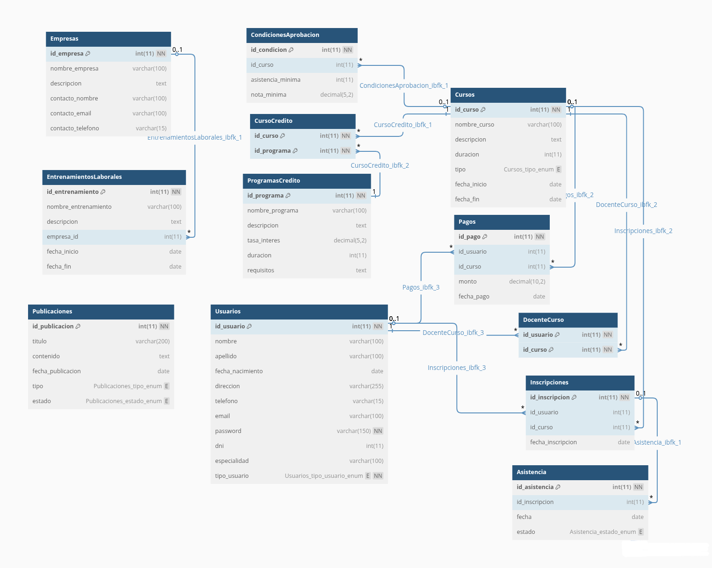

# IncubadoraBackend
Proyecto Xacademy 2025

## Instrucciones Creacion base de datos y back End en sus Entornos

*Para hacer  solicitudes a la api localmente una ves que carguen la base de datos mediante el codigo sql  ,recuerden crear el archivo .env en el proyecto y especificar el usuario contraseña y puerto de acceso a sus bases de datos mysql de esta forma( para especificar el puerto que usan si tienen varios bases de datos  en sus pc  esta en 3307  pueden cambiarlo a 3306):*
  
```markdown
  DB_HOST=localhost
  DB_USER=
  DB_PASS=
  DB_NAME=NOC
  DB_PORT=3307

```
Para correr el proyecto desde consola:  npm run dev

Valores devueltos ejemplo( http://localhost:3000/user/findById/4 )

```markdown
{
  "id_usuario": 4,
  "nombre": "Carlos",
  "apellido": "Gómez",
  "fecha_nacimiento": "2004-10-22",
  "direccion": "Av. Rivadavia 456",
  "telefono": "1134567890",
  "email": "carlos.gomez@gmail.com",
  "password": "carlos123",
  "dni": 40234567,
  "especialidad": null,
  "tipo_usuario": "alumno"
}
```

*Si es un docente deben incluir su especialidad:"Biologia" etc, y tipo_usuario :"docente" en el back esta contemplado que puede ser un campo vacio la especialidad por el alumno deben realizar validaciones para que los datos sean los esperados en el BackEnd.*



##  Pueden revisar si se estan conectando a la base de datos  ingresando las siguientes rutas en el navegador: 

### Seccion Usuario

```Markdown 
| Método | Descripción                  | URL completa (HTTP)                          ejemplo              |
| ------ | ---------------------------- | ----------------------------------------------------------------- |
| POST   | Iniciar sesión               | `http://localhost:3000/user/login`                                |
| POST   | Crear un nuevo usuario       | `http://localhost:3000/user/create`                               |
| GET    | Obtener todos los usuarios   | http://localhost:3000/user/find   (por dni,(nombre o similar),(apellido o similar); por omicion todos )    |
| GET    | Obtener un usuario por ID    | http://localhost:3000/user/findById/12                          |
| PUT    | Actualizar un usuario por ID | `http://localhost:3000/user/update/12`                            |
| DELETE | Eliminar un usuario por ID   | `http://localhost:3000/user/delete/123`                           |
|        | Perfil del Docente           | `http://localhost:3000/user/perfildocente`                        |
|        | Perfil del Alumno            | `http://localhost:3000/user/perfilalumno`                         |

```
*Ejemplo ruta(http://localhost:3000/user/find ) con parametros:*

*1. 🔎 Buscar por DNI(coincidencia exacta para dni)*
*GET  http://localhost:3000/user/find?dni=12345678*
*2. 🔎 Buscar por nombre (o similar)*
*GET  http://localhost:3000/user/find?nombre=juan*
*3. 🔎 Buscar por DNI y nombre*
*GET  http://localhost:3000/user/find?dni=12345678&nombre=juan*
*4. 🔎 Buscar por nombre e apellido (o similar)*
*GET  http://localhost:3000/user/find?nombre=juan&apellido=Ma*
*5. 🔎 Buscar por todos los parámetros*
*GET  http://localhost:3000/user/find?dni=12345678&nombre=juan&apellido=Ma*

### Seccion Inscripciones
```Markdown
| Método | Descripción                       | URL completa (HTTP)                        ejemplo    |
| ------ | --------------------------------- | ----------------------------------------------------- |
| POST   | Crear una inscripción             | `http://localhost:3000/inscripciones`                 |
| GET    | Obtener todas las inscripciones   |  http://localhost:3000/inscripciones                  |
| GET    | Obtener una inscripción por ID    |  http://localhost:3000/inscripciones/12               |
| PUT    | Actualizar una inscripción por ID | `http://localhost:3000/inscripciones/12 `             |
| DELETE | Eliminar una inscripción por ID   | `http://localhost:3000/inscripciones/12 `             |

```
### Seccion Asistencias
```Markdown
| Método | Descripción                      | URL completa (HTTP)                       ejemplo  |
| ------ | -------------------------------- | -------------------------------------------------- |
| POST   | Registrar una nueva asistencia   | `http://localhost:3000/asistencias`                |
| GET    | Obtener todas las asistencias    |  http://localhost:3000/asistencias                 |
| GET    | Obtener una asistencia por ID    |  http://localhost:3000/asistencias/12              |
| PUT    | Actualizar una asistencia por ID | `http://localhost:3000/asistencias/12`             |


```

### Seccion Cursos
```Markdown
| Método | Descripción                | URL completa (HTTP)                  ejemplo   |
| ------ | -------------------------- | ---------------------------------------------- |
| GET    | Obtener todos los cursos   |  http://localhost:3000/cursos                  |
| POST   | Crear un nuevo curso       | `http://localhost:3000/cursos`                 |
| PUT    | Actualizar un curso por ID | `http://localhost:3000/cursos/123`             |
| DELETE | Eliminar un curso por ID   | `http://localhost:3000/cursos/123`             |

```
### Seccion Empresas
```Markdown
| Método | Descripción                   | URL completa (HTTP)                        ejemplo          |
| ------ | ----------------------------- | ----------------------------------------------------------- |
| GET    | Obtener todas las empresas    |  http://localhost:3000/empresas                             |
| POST   | Crear una nueva empresa       | `http://localhost:3000/empresas`                            |
| PUT    | Actualizar una empresa por ID | `http://localhost:3000/empresas/12`                         |
| DELETE | Eliminar una empresa por ID   | `http://localhost:3000/empresas/12`                         |

```
### Seccion Publicaciones
```Markdown
| Método | Descripción                       | URL completa (HTTP)                      ejemplo                 |
| ------ | --------------------------------- | ---------------------------------------------------------------- |
| GET    | Obtener todas las publicaciones   |  http://localhost:3000/publicaciones                             |
| POST   | Crear una nueva publicación       | `http://localhost:3000/publicaciones`                            |
| PUT    | Actualizar una publicación por ID | `http://localhost:3000/publicaciones/12`                         |
| DELETE | Eliminar una publicación por ID   | `http://localhost:3000/publicaciones/12`                         |

```


